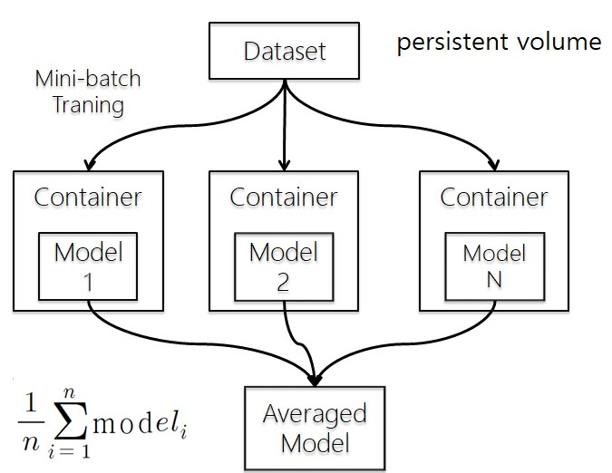

## modelaverage

<p align="center">
    
    
</p>

`modelaverage` is a pip package that calculates the average value of the same model, inspired by [Average weights in keras models](https://stackoverflow.com/questions/48212110/average-weights-in-keras-models). I created it to train each mini-batch in one container as distributed computing environment, `kubernetes`.



## Usage

1. `pip install modelaverage` or `git clone https://github.com/graykode/modelaverage && python setup.py install`

2. using function `average(modellist)`

   - modellist : list of model file names. type should be `list`

     > averaged_model = average(['mnist1.h5', 'mnist2.h5',....])

   - return : input models of averaged weight


## Example

Please see [example](https://github.com/graykode/modelaverage/blob/master/example/example.py).

```python
import tensorflow as tf
from modelaverage import average

modellist = ['models/mnist1.h5', 'models/mnist2.h5', 'models/mnist3.h5', 'models/mnist4.h5', 'models/mnist5.h5',
             'models/mnist6.h5', 'models/mnist7.h5', 'models/mnist8.h5', 'models/mnist9.h5']

averaged_model = average(modellist)

for w in averaged_model.get_weights():
    print(w.shape)
```


## Author

- Name : Tae Hwan Jung(@graykode)
- Email : nlkey2022@gmail.com
